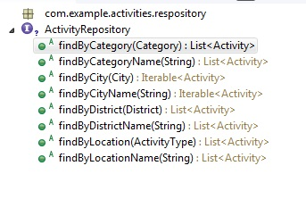

SUMMARY
-------
sep-12th

The implemented solution keep the information model at the center. I wanted a **simple, elegant but powerful and enterprise ready solution ** (but probably I invested more time than necessary..)
The core of the solution is in the ActivityRepository.java class (and the model definition and validation) where it is easy to create several powerful database queries in the future (**just declare the new query in the repository interface**). Moreover, having a data abstraction layer +  the API REST abstraction layer.... with the possibility to create an **hypermedia API** (currently disabled with security in mind) is a plus. 

Using spring-data (updated), and the data layer (based on Hibernate and JPA), the SQL Injection has lower probability. 

Start date: aug-28 22:10

ANALYSIS
---------

The first step I did was reading carefully the instructions. I read it on my mobile while I was on holidays, but immediately my mind was bringing to me some ideas about how to proceed. I had had several ideas during a week, until I found the time to seat on the laptop. Now I have to say that during these days I dedicated some time to see some interesting videos about "Carto Location", and read some interesting blog posts. It was useful to me for several purposes: get inspiration and introducing me into the mind of Location Engineer :-)

I have some experience working with GeoJSON, tiles, and geographic information (GeoServer, TileServer, Leaflet). But after this week, if I have to develop a solution using maps information, specially in the case of the proposed test, probably I choose Carto as platform... but I assume that it is not the intention of this test. I mean, I don't like to reinvent the wheel, and having a database and an API to work with it that servers the proposed use cases.... why not load the data in Carto and create (if it not exists into native Carto) a wrapper gateway, or application, like a GraphQL Microservice, serving the expected GeoJSON in two specific endpoints and bypassing the possible errors to the client in an specific field....

As I mentioned, the first thing I want to write down are the use cases. So I describe here some uses cases I extracted from the instructions. I hope it will help me to understand the problem better.

USE CASES (ordered by priority)

- As a user, I'd like to have a program that provides me with a list of places helps me to do activities in an efficient manner.
- As a user, I want a program that allows me to filter activities in a city by several fields, including location
- As a user, I want recommendations about what to visit during specific time slots
- As a user, I expect that the application is working 24/365 without down time
- As a user, I want the application response almost "instantly" to my requests
- As a developer, I want an API where I can ask for recommended activities to do in Madrid
- As a product owner, I want the system to be scalable in a fast peace (extended to other cities, and used by millions of users)

- As a user, I want that visits recommendations take into account the actual or future weather
- As a user, I want the application takes into account the transportation between different activities.
- As a developer, I want to be the more independent possible from the used frameworks
- As a developer, I want to make future changes easy. -> Hexagonal Architecture, GraphQL -> Explanation: my experience with APIs is that it is difficult to maintain it, specially with different versions, or when adding new fields, when deprecating endpoints, etc. Taking into account that we will define an INFORMATION MODEL to work with (that can be extended in the future), it should be easier to develop applications using GraphQL endpoints and, if required by the frontend, convert the GrpahQL to fixed endpoints.

Possible future uses cases
- As a user, I want to know about other people opinion for the activities
- As a user, I want to collaborate and share my opinion about an activity  
- As a user, I want to have real time information about the estimated people doing an activity, or that recommendation engine takes it into account.

Well, I recognize that I started to imagine a bigger solution with more features than requested ones... 

PROPOSED SOLUTION
-----------------

As a first solution, taking into account that I have experience with Java and some libraries and frameworks, it comes to my mind to use Spring-Boot with Spring-Data and Spring-REST for all the code. I thought that it can serve to me for creating a rapid prototype, but also to re-use the created code in a more serious and professional work in the future. The instructions doesn't talk about some requirements that can be considered as Non Functional Requirements, so I supposed that there are some NFR that should be taken into account: 

NFR:
- NFR-01 Application should bue **updated without downtime**
- NFR-02 In the future it should be possible to **restrict data access using some granularity**. 
Usually it requires taking it into account when defining the DATA INFORMATION MODEL, almost taking it into account from the beginning will avoid serius problems migrating data in the future. Moreover, it can require some kind of authtentication when using the API. Having an API Manager to allow access to some resources on enterprise applicaitons it isn't enough usually, so having a modular software where you can add layers for each purpose it's a good thing. If it doesn't cost you more initial work, why don't architect your software solution using this architecture.
- NFR-03 **Audit calls to the API and data access for debugging, improvement, and analytics** (What/When people ask to the system?, How many requests do until they get satisfactory results?
- NFR-04 Code should be **multi-platform** (I'm thinking in docker, but the code should work on Windows and Linux docker containers)
- NFR-05 The **API should be able to merge information from different data sources** in the future.
- NFR-06 It should be easy for system maintainers to **load a new updated file with activities and add new cities**.
- NFR-07 It should be easy to insert information from different or distinct data sources in the future, with minimal changes to the code.
- NFR-08 The **API should be auto-documented when code changes** -> using OpenAPI 
- NFR-09 **API calls should be capable of returning error information**
- NFR-10 API should allow for using **Hypermedia** allowing to navigate easily between endpoints and/or features(visits)
- NFR-11 The response type (actually GeoJSON) might be different for other applications in the future. (It's mandatory that the REST Client specify the "Accept" HTTP header) 
- NFR-12 A **unique identifier for activities** is required to avoid duplicate places when updating database -> Place name will be used for this purpose and an unique identifier will be assigned by the database.

ALTERNATIVE SOLUTION
---------------------

I'm aware that there is a very simple solution to the problem: for example I could develop an application using Node.js or Java or .Net Standard that load, transform and store the file/ or files of the cities into a memory database, or assume it is yet loaded (ehcache, postgis, geopackage), then, serves the requests. It will do the expected task.. later if you want to scale out the application, you can launch several instances of the container, and put a load balancer at the front. It's is possible to launch several container for each city, so the solution will be more scalable. The only storage you will need in that case is the city.json and a very good orchestrator and load balancer. The application log can be sent to a central docker/database for future audits if required. In my opinion, when the information is read-only (and without required access control) , it is easy to scale out the application, it can be a kind of simple and elegant solution, but when things evolve in the future, it can be tricky to manage the changes if you don't have well defined and decoupled layers of software (that it's possible using MicroServices approach). For example: doing queries for filter or recommendations if the information is not stored and indexed into a database (NoSQL like Mongo, or more specific for the purpose like PostGIS) might be complicated, specially when query for time slots.
Note: I'm not sure about the MongoDB support for geographic information, and working with JSON in the backend doesn't allow for future geographic information transformation, querying, etc... 
Because I wanted to demonstrate my knowledge about enterprise software solutions, I decided to implement the first one proposed because I'm sure it serves the actual requirements but also the future ones. A will assume the risk that spring-data with hibernate-spatial my not work as expected.... I never used it before, but I love learning by doing and sincerely, this test is the perfect opportunity.

28-08 23:12 It has taken to me 1 hour to describe all this thoughts

IMPLEMENTATION STARTS
--------------------

Additional tasks:
- I worked with GeoJSON in the past, but I have to review the specification during 10 minutes.
- I also read about ogr2ogr software during my holidays, so I searched for a Java wrapper: I found it.

Information recollection for the GIS solution. 
- I found that GDAL-OGR have a Java extension, so I will try to use it for load and extract of the data. It will bring all the possibilities that GDAL will offer in future versions to the implemented solution, like new storage drivers for the information, or extracting the information directly for 3th party updated databases (like web scrapping...) -> FINALLY DISCARDED, I USED A GeoJSON library that works with Jackson.
- I wanted to use PostGIS to store information, but as I will use a data layer abstraction with Spring-Data, it will be easy to change to another storage system like GeoPackage (or may be Carto in the future ;-)
- The weather can be obtained from an external API, it should be collected and stored for future analysis, when implemented, I will take it into account when designing the data model.

Weather collector -> Distributed database using PostGIS
Data loader ->
Api Query ->

The city is a property or field of the "visit", it will be considered as an special property to create specific endpoints, but at the end, it will we considered as a field in the data model.

References (* if it is directly related with the final implementation):
- How to work with JSON directly in postgres http://www.postgresqltutorial.com/postgresql-json/
- What drivers (formats) are available for GDAL OGR https://www.gdal.org/ogr_formats.html
- postgis-spring-data-jpa-example https://github.com/vasily-kartashov/postgis-spring-data-jpa-example
- Spring-boot-spatial-example https://github.com/mstahv/spring-boot-spatial-example
- working with jsonb in postgres https://hackernoon.com/how-to-query-jsonb-beginner-sheet-cheat-4da3aa5082a3
- Spring REST Docs https://spring.io/projects/spring-restdocs 
- Creating a GeoJSON FeatureCollection Type for GrpahQL https://medium.com/@brygrill/creating-a-geojson-featurecollection-type-for-graphql-352591451b4a
- Hibernate-spatial https://www.baeldung.com/hibernate-spatial
- A Geospatial Messenger with Kotlin, Spring Boot and PostgreSQL https://spring.io/blog/2016/03/20/a-geospatial-messenger-with-kotlin-spring-boot-and-postgresql
- Creating GeoJSON Feature Collections with JSON and PostGIS functions http://www.postgresonline.com/journal/archives/267-Creating-GeoJSON-Feature-Collections-with-JSON-and-PostGIS-functions.html
- REST API search language spring data query dsl https://www.baeldung.com/rest-api-search-language-spring-data-querydsl
- Query DSL with JPA tutorial https://www.baeldung.com/querydsl-with-jpa-tutorial
- Spring Boot and Hibernate Spatial PostGis demo https://github.com/chrissssss/springboot-hibernatespatial-postgis-demo
- Detecting new entities using spring-data-jpa http://dkublik.github.io/persisting-natural-key-entities-with-spring-data-jpa/

FINAL SOLUTION FOR THE TEST
---------------------------

Later.. after the investigation and once I've done the mental exercise of writing down my thoughts, I realized that for the exercise purpose probably it is enough storing the information in a GeoPackage (due the abstraction layer) but it can be used with PostGIS using the specific driver and PostGIS extension. I'm sorry, I was on holidays, and don't want to spend more than 3-4 hours doing this test due to minor issues connecting, installing or instantiating a database. It's the same for other NFR I've defined, I think the idea is to show my mental process and the objective is more or less shown. 

Solution Modules:
- API documentation (not implemented, but I suggest using Swagger, or Spring REST Docs)
- API endpoint
- DataLayer (I will try to use Hibernate Spatial, a 3th party library found on GitHub, I assume that 
- Database (GeoPackage)
- DataLoader (using DataLayer) 

Information Model: (UPDATE: it will suffer minor changes during development)

Activity
- Id (PK)
- ActivityName (UNIQUE)
- Location: GeoJson Features stored as Geometry field of visits.
- Hours_Spent -> timespan
- CityId
- CategoryId
- LocationId
- DistrictId

ActivityOpeningHours (old valid time dates remain in the database)
- Id (PK)
- ActivityId (indexed)
- ValidFrom 
- ValidTo (null)

ActivityOpeningHoursDetail (it contains a tuple for each opened time slot allowing for mid-day closing, or any kind of periods like weeks,... )
- Id (PK)
- VisitOpeningHoursId
- Period (week)
- OpeningHour
- OpenInterval

CategoryId
- Id
- CategoryName

LocationId
- Id
- LocationName

DistrictId
- Id
- CityId
- District
- Area (Geometry)

City (populated using the name of the file)
- Id
- Name
- Area (Added later during development(1))
- [Country]

Weather (not implemented) 
- Id
- CityId
- Timestamp ((period of 1 hour)
- Estimation (yes/no)
- WeatherTypeId

WeatherTypeId (not implemented)
- Id
- Weather (Sunny, Cloudy,...) 
- Temperature

API Request:
- Responses have to include an "error" property when necessary (errors ocurs in the real world), and a "data" field with the returned data (containing the GeoJSON). More fields can be added in the future if it's required. The type of the response (GeoJSON) should be requested in the "Accept" header. 

end aug-29 1:09

PROBLEMS FOUND 
-------------------
1.- The bigger issue I encountered during design phase has been "how to store opening hours". I have large experience storing time slots, working with daylight saving time, and working with time zones (when I created the software to manage irrigation programs for IoT devices), and this is the reason why I actually know that it is not an evident design. Whenever possible the solution should have several requirements to avoid future headaches: 
	- usually there is repetition in opening tables, but may exist differences between some weeks, etc (in the real world)
	- working with times is difficult if you take into account different languages and time zones, so storing time in UTC is the best solution usually. But you have to "fight" with time conversions at some point in your software stack. Depending how you modeled the information, it can be more or less tricky... it's important to be careful to not expose this issue to the final user.. In that case, I decided to use the local time, storing also de time zone for conversion if needed because the activity will be done in the local time.
	- In my experience, working with week days, instead of more general periods, may arise issues in the future. Ex: **when opening hours of a period start in one day but ends in the next day.**
	- The same activity can have different opening times in summer or winter, or it can be changed from a point in time.... 
	- If I want to know when a activity was opened in the past, this information should remain in someplace, may be an old opening_times table to avoid performance issues.
	For reference, I left here a question at Stack Overflow, but in my opinion it is not the best possible solution: https://softwareengineering.stackexchange.com/questions/310557/storing-hours-a-merchant-is-open-in-postgres

2.- resolución de conflictos de versiones de librerías (1,5 horas)
	- I know sometimes it is necessary to find a workaround, but in that case, I feel free to dedicate time and I wanted to find the solution to the problem. It's not easy to work software projects when you are working with libraries not supported. This is the reason why "divide y vencerás" strategy, using MicroServices (understud as different docker containers with it's own dependencies), is a very good aproximation. In my case, I tried to continue with spring-boot and hibernate-spatial.
	
 Several hours after finding and testing things, I found this question in StackOverflow. 
	https://stackoverflow.com/questions/31440496/hibernate-spatial-5-geometrytype
	
 And it brings me to a repository that "in theory" have some of the responses: it is a similar solution to the one I have in mind, but it is using the LATEST version of Spring-Boot (in beta), and I was trying to use the last RELEASED stable version. 
	
 The repository some answers to my questions https://github.com/Wisienkas/springJpaGeo/, but as it is using LATEST and the last commit is from year 2017, the project doesn't execute. **You never should use LATEST version in a project, unless you are testing or doing CI...**
	
 Finally, after some coffee, reviewing the official Hibernate documentation, and doing some tests changing versions in the project, **I found that the issue was with the library geolatte-geom, using version 1.13 instead of 1.12 (the spring-boot included one) works perfectly, without changing other default versions managed by spring-boot 2.0.4.RESLEASE (the last released version at the moment)**

3. How to @autowire in Jackson Deserializer. Not the best practice may be, but usefull in that case for the import of the JSON. I solved thanks to Stack Overflow (and official documentation), as many other minor issues I found during development. 
	Finally I solved this issue. Because I received a mail from Carto that the test has finished, due to the finish of the process, I wanted to solve this issue because for my own interest. Have I said that doing this test has been fun? 
	
4. During startup the docker-compose for production, the web application fails due to a timeout. The postgis container starts, but the database connection listening take some time the first one... spring-boot database connection params has been tweeked:

spring.datasource.hikari.login-timeout=30000
spring.datasource.hikari.initialization-fail-timeout=30000
spring.datasource.hikari.connection-timeout=30000

5. Postgis image used has a bug that doesn't allow app to connect without fix the posgis image
https://github.com/kartoza/docker-postgis/pull/82
	
DECISIONS
-------

1. Should I use Jackson custom serializer to read Madrid.json, or should I use ObjectMapper and a custom Object. The first one offers the possibility to avoid using intermediate objects, and map directly to Activity object, while the second one requires less effort but more steps and memory for reading the file, managing versions and schema changes in that case could be also difficult in the future. There is a 3th option, that's reading the entire file in a JSONObject and make a custom mapping, this is an intermediate solution, with more flexibility and less boilerplate code, but also requires more memory, so I decided to use the Serializer / Deserializer option.
	**CONCLUSION** (after some days with attach / detach entities issues...): It is correct if you can manage the attach of exist entities in the database. In other case, be careful when instantiating in the same returning list the same detached instance twice (or more). **This issue (and my lack of spare time get me out of time to present the test)**
	
2. I assumed the JSON is as it is. Activities doesn't have an Id, so I decided a "Natural Id" (name as a general rule) to avoid duplicate data in the database. A real system might need to import data several times, for example.   

3. For this test, the database is always truncated and recreated, but it can be changed for production systems.
	
PROS
----

- Using spring-data, there is a lot of **code that can be avoided**, assure the **quality and the flexibility for the application** is easier (when you get all the pieces finally working...)
- Spring-Data uses Hibernate, that in fact, allows to use **Multi-Tenancy for datasource access**. This is a very interesting use case in the future. http://docs.jboss.org/hibernate/orm/5.2/userguide/html_single/Hibernate_User_Guide.html#multitenacy 
- **Adding a new field or property is easy**, the application can manage it automatically but on the other hand, spring-data in combination with Hibernate, allows you to **customize the database physical model**, or whatever you need in benefit of performance.
- I decided to use the **city as a categorizer**, because **the city means only a specific area in the world**.

(1) IDEAS DURING DEVELOPMENT
-----------------------
- While I was implementing the solution, I wanted to think about the information model and how to use it, so I asked me the next question: 
	Question 1: Is Linking activities with a City the best form to get all interesting activities in a city? What will happen when I need to get activities information using different criteria? 

That question makes me to the next one:
	Question 2: Should I use a table to map cities, and link it with activities, or it is better to Geocode cities, and use these information to get all the activities in a "city"? 
	Answer: I really thought that the second one option, use location to find activities in a "city" is probable a better idea, the reason for this is that, generally speaking, the location information could be much more accurate than the city information when searching activities in an area or near a "city". The same "point" Feature information, can be used to filter by different criteria.

Finally I decided to add an optional field "Area" to the entity City. 

- Create some useful example test using cucumber. https://www.baeldung.com/cucumber-spring-integration
  I not invested time doing unit testing, but I'm aware that this should be done in order to have a maintenable code.
  
- It is possible to decouple this application into two modules with the main objective of separate the internal data layer (allowing to be consumed by other services, not only REST) from the REST service. It should be easy using spring-boot and using an external, but efficient, communication layer for all the services. Aka, convert this Monolithic application into a MicroService application for better scalability.

LESSONS LEARNED
---------------
- If I have to do the test in the future, I'll probably take a different approach. It seems much more easy to geocode districts, country, cities, and store all activities in a partitioned table (when using a lot of data). Then, make queries to the information using "geoqueries".

- I designed my own information model in order to have a better base and not use the one in the JSON. I invested a lot of time to deserialize the JSON due to the problems with attach/detach with Jackson. The positive part is that **a well defined information model help to maintain data consistency**. Two examples:

<pre>
2018-09-11 20:35:55.061 ERROR 10220 --- [           main] o.h.engine.jdbc.spi.SqlExceptionHelper   : ERROR: duplicate key value violates unique constraint "uk_1n57i7ctoraxuv6rokyvfmlm0"
  Detail: Key (name)=(Centro) already exists.
</pre>

<pre>  
Caused by: org.postgresql.util.PSQLException: ERROR: null value in column "city_id" violates not-null constraint
  Detail: Failing row contains (3, Centro, null).
	at org.postgresql.core.v3.QueryExecutorImpl.receiveErrorResponse(QueryExecutorImpl.java:2440) ~[postgresql-42.2.4.jar:42.2.4]
	at org.postgresql.core.v3.QueryExecutorImpl.processResults(QueryExecutorImpl.java:2183) ~[postgresql-42.2.4.jar:42.2.4]
	at org.postgresql.core.v3.QueryExecutorImpl.execute(QueryExecutorImpl.java:308) ~[postgresql-42.2.4.jar:42.2.4]
	at org.postgresql.jdbc.PgStatement.executeInternal(PgStatement.java:441) ~[postgresql-42.2.4.jar:42.2.4]
</pre>

- I probably targeted an ambitious objective creating a solid base to execute future complex queries using a predicate or geographic spatial queries directly from a strong typed language like Java... I spent much more hours than the required to answer the test.. probably working in a team it dosen't occur, due to the 'daily' review, and continuous dedication

- This isn't the first test I do, but it is the first one where I don't finish it on time (due to the lack of time and the open specifications). Lesson Learned.      

CONCLUSION
----------
- I enjoyed a lot doing this test (in my little spare time)... May be the next one.......

Thank you for the opportunity
=============================
Thank you for taking your time to read this

-------------------------

MY NOTES FOR DEVELOPMENT

* postgres query for time
\set day '2018-04-12'

  select ats::time,
         substring(hash from 1 for 8) as hash,
         substring(subject from 1 for 40) || '…' as subject
    from commitlog
   where project = 'postgres'
     and ats >= date :'day'
     and ats  < date :'day' + interval '1 day'
order by ats;

* Init respository using data layer -> https://github.com/mstahv/spring-boot-spatial-example/blob/master/src/main/java/org/vaadin/example/SpatialSpringBootAppApplication.java

